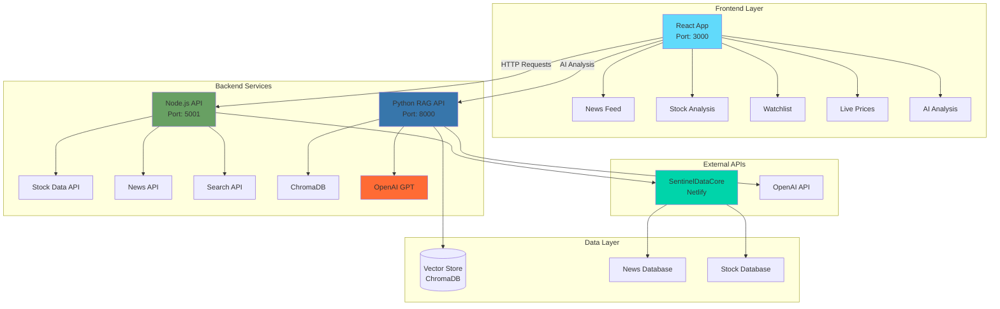
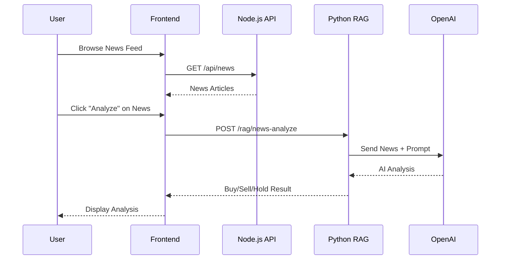
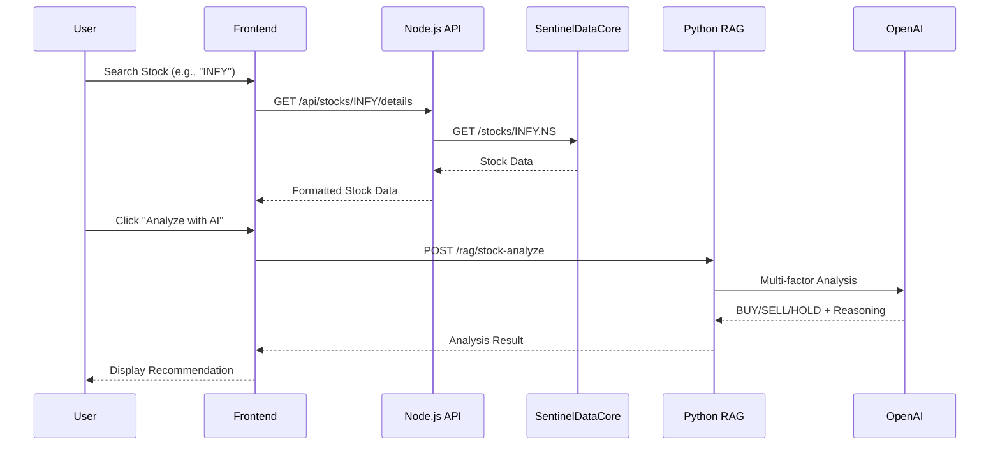

# 🚀 TradeNexus

**AI-Powered Financial Trading Platform with RAG-Based News Analysis**

<div align="center">

[](https://opensource.org/licenses/MIT)
[](https://nodejs.org/)
[](https://python.org/)
[](https://reactjs.org/)
[](https://fastapi.tiangolo.com/)

_A comprehensive trading platform that combines real-time market data, AI-powered news analysis, and advanced filtering tools to help traders make informed investment decisions using cutting-edge RAG technology._

[🚀 Quick Start](#-installation--setup) • [📚 Documentation](#-api-documentation) • [🎯 Features](#-features) • [🤝 Contributing](#-contributing)

</div>

---

## 📋 Table of Contents

- [🌟 Overview](#-overview)
- [✨ Features](#-features)
- [🏗️ System Architecture](#️-system-architecture)
- [🛠️ Technology Stack](#️-technology-stack)
- [📁 File Structure](#-file-structure)
- [🚀 Installation & Setup](#-installation--setup)
- [🔄 Feature Workflows](#-feature-workflows)
- [🧠 RAG Implementation](#-rag-implementation)
- [📚 API Documentation](#-api-documentation)
- [⚙️ Environment Configuration](#️-environment-configuration)
- [📖 Usage Guide](#-usage-guide)
- [🤝 Contributing](#-contributing)
- [📄 License](#-license)

---

## 🌟 Overview

TradeNexus is a modern financial trading platform that leverages artificial intelligence and machine learning to provide traders with intelligent insights. The platform uses RAG (Retrieval-Augmented Generation) technology to analyze financial news and combine it with technical indicators to generate actionable Buy/Sell/Hold recommendations.

### Key Capabilities

- 📊 **Real-time Market Data Integration** via SentinelDataCore API
- 🤖 **AI-Powered News Analysis** using OpenAI GPT models
- 🔍 **RAG-based Information Retrieval** for contextual analysis
- 📈 **Multi-factor Stock Analysis** combining technical and fundamental data
- 🎨 **Interactive Dashboard** with modern React UI

---

## ✨ Features

### 🔥 Current Features

| Feature                          | Description                                                      |
| -------------------------------- | ---------------------------------------------------------------- |
| 📈 **Trending Sector Stocks**    | Discover top-performing stocks by sector with real-time metrics  |
| 🔍 **Sector Drilldown**          | Deep dive into specific market sectors with comparative analysis |
| ⚡ **Live Price Simulation**     | Real-time market price tracking with alerts and visualization    |
| 📰 **News Section with Search**  | Searchable financial news feed with AI sentiment scoring         |
| 🤖 **AI News Analysis**          | RAG-powered individual news analysis with recommendations        |
| 📋 **News Watchlist**            | Save and batch analyze multiple news items                       |
| 🎯 **Buy/Sell/Hold AI Analysis** | Multi-factor stock analysis with AI-generated recommendations    |
| 🔧 **Smart Filtering**           | Advanced stock discovery tools with custom criteria              |

---

## 🏗️ System Architecture



---

## 🛠️ Technology Stack

### Frontend

- **React 18** - Modern UI library with hooks
- **React Router DOM** - Client-side routing
- **Axios** - HTTP client for API requests
- **Tailwind CSS** - Utility-first CSS framework
- **Lucide React** - Beautiful SVG icons

### Backend (Node.js)

- **Express.js** - Web application framework
- **CORS** - Cross-origin resource sharing
- **Axios** - HTTP client for external APIs
- **dotenv** - Environment variable management

### AI & RAG Backend (Python)

- **FastAPI** - High-performance API framework
- **OpenAI** - GPT models for analysis
- **ChromaDB** - Vector database for embeddings
- **Pydantic** - Data validation and settings
- **python-dotenv** - Environment management

### External Services

- **SentinelDataCore** - Stock and news data API
- **OpenAI API** - Large language models
- **Netlify** - Hosting for SentinelDataCore

---

## 📁 File Structure

```
TradeNexus/
├── 📁 Client/                          # React Frontend Application
│   ├── 📁 public/
│   │   ├── 📄 index.html
│   │   └── 📄 favicon.ico
│   ├── 📁 src/
│   │   ├── 📁 components/
│   │   │   ├── 📄 NewsFeedDisplay.jsx           # News feed with search
│   │   │   ├── 📄 NewsWatchlist.jsx             # Saved news management
│   │   │   ├── 📄 TrendingSectorsDisplay.jsx    # Sector trends
│   │   │   ├── 📄 SectorDrilldown.jsx           # Detailed sector analysis
│   │   │   ├── 📄 LivePriceSimulation.jsx       # Real-time prices
│   │   │   ├── 📄 SmartFiltering.jsx            # Stock filtering
│   │   │   └── 📄 BuySellHoldAnalysis.jsx       # AI stock analysis
│   │   ├── 📄 App.jsx                           # Main application component
│   │   ├── 📄 index.js                          # React entry point
│   │   └── 📄 index.css                         # Global styles
│   ├── 📄 package.json                          # Dependencies & scripts
│   └── 📄 .env                                  # Environment variables
│
├── 📁 Server/                          # Node.js Backend API
│   ├── 📄 server.js                   # Main server entry point
│   ├── 📄 feature1_trendingSectors.js # Trending stocks API
│   ├── 📄 feature2_sectorDrilldown.js # Sector analysis API
│   ├── 📄 feature3_livePriceAlerts.js # Live price API
│   ├── 📄 feature4_smartFiltering.js  # Smart filtering API
│   ├── 📄 feature5_news.js            # News API endpoints
│   ├── 📄 feature6_stock_details.js   # Stock details & analysis
│   ├── 📄 package.json                # Dependencies & scripts
│   └── 📄 .env                        # Environment variables
│
├── 📁 Python/                         # RAG AI Backend
│   ├── 📄 main.py                     # FastAPI server
│   ├── 📄 feature4_news_rag.py        # News analysis RAG
│   ├── 📄 feature6_stock_analysis.py  # Multi-factor stock analysis
│   ├── 📄 documentloader.py           # Data fetching utilities
│   ├── 📄 requirements.txt            # Python dependencies
│   └── 📄 .env                        # Environment variables
│
├── 📄 README.md                       # Project documentation
├── 📄 .gitignore                      # Git ignore rules
└── 📄 LICENSE                         # MIT License
```

---

## 🚀 Installation & Setup

### Prerequisites

Ensure you have the following installed:

- [Node.js](https://nodejs.org/) (v18 or higher)
- [Python](https://python.org/) (v3.8 or higher)
- npm or yarn package managers
- [OpenAI API Key](https://platform.openai.com/api-keys)

### Step 1: Clone Repository

```bash
git clone https://github.com/yourusername/TradeNexus.git
cd TradeNexus
```

### Step 2: Frontend Setup (React)

```bash
cd Client
npm install
```

Create `.env` file in `Client/`:

```env
REACT_APP_SERVER_URL=http://localhost:5001
REACT_APP_RAG_SERVER_URL=http://localhost:8000
```

### Step 3: Backend Setup (Node.js)

```bash
cd ../Server
npm install
```

Create `.env` file in `Server/`:

```env
PORT=5001
NODE_ENV=development
SENTINEL_API_URL=https://sentineldatacore.netlify.app/api
```

### Step 4: AI Backend Setup (Python)

```bash
cd ../Python
pip install -r requirements.txt
```

Create `.env` file in `Python/`:

```env
OPENAI_API_KEY=your_openai_api_key_here
API_URL=http://localhost:5001/api
RAG_PORT=8000
```

### Step 5: Run the Application

Start all services in separate terminals:

**Terminal 1 - Node.js Backend:**

```bash
cd Server
node server.js
```

✅ Server running on http://localhost:5001

**Terminal 2 - Python RAG API:**

```bash
cd Python
python main.py
```

✅ RAG API running on http://localhost:8000

**Terminal 3 - React Frontend:**

```bash
cd Client
npm start
```

✅ Frontend running on http://localhost:3000

### 🎯 Access Points

- **Main Application:** http://localhost:3000
- **API Documentation:** http://localhost:8000/docs
- **Health Check:** http://localhost:5001/api/health

---

## 🔄 Feature Workflows

### 1. News Analysis Workflow



### 2. Stock Analysis Workflow



---

## 🧠 RAG Implementation

### Overview

TradeNexus uses **Retrieval-Augmented Generation (RAG)** to enhance AI analysis by combining:

- **Retrieval:** Finding relevant financial news and data
- **Augmentation:** Enriching prompts with contextual information
- **Generation:** Producing informed investment recommendations

### Core Libraries

```python
# Vector Database
chromadb==0.4.15              # Vector storage and similarity search

# AI/ML Libraries
openai==1.3.0                 # GPT models for text generation
sentence-transformers==2.2.2  # Text embeddings

# Data Processing
pandas==2.1.3                 # Data manipulation
numpy==1.24.3                 # Numerical operations

# API Framework
fastapi==0.104.1              # High-performance API
uvicorn==0.24.0               # ASGI server
```

### RAG Architecture Components

1. **Document Loader** - Fetches news and stock data
2. **Text Chunking** - Splits content into manageable pieces
3. **Vector Storage** - ChromaDB for embeddings
4. **Retrieval System** - Finds relevant context
5. **Prompt Engineering** - Structured prompts for analysis

### Performance Optimization

- **Chunk Size:** 500 tokens (optimal for financial news)
- **Overlap:** 50 tokens to maintain context
- **Similarity Threshold:** 0.7 for relevant results
- **Caching:** Frequent queries cached for performance

---

## 📚 API Documentation

### Node.js Backend Endpoints

#### Stock Endpoints

```
GET  /api/stocks/:symbol/details    # Get detailed stock information
GET  /api/stocks/:symbol/news       # Get stock-specific news
GET  /api/stocks/search?q=query     # Search stocks by symbol/name
GET  /api/stocks/list               # Get all available stocks
```

#### News Endpoints

```
GET  /api/news                      # Get all news articles
GET  /api/news/search?q=query       # Search news articles
GET  /api/news/:id                  # Get specific news article
```

### Python RAG API Endpoints

#### Analysis Endpoints

```
POST /rag/news-analyze              # Analyze individual news
POST /rag/stock-analyze             # Multi-factor stock analysis
```

#### System Endpoints

```
GET  /                              # Health check
GET  /health                        # Detailed health check
GET  /docs                          # OpenAPI documentation
```

### Example Request/Response

**Stock Analysis Request:**

```json
POST /rag/stock-analyze
{
  "query": "Analyze INFY stock:\n\nStock Details:\n- Current Price: ₹1,789.45\n- Volume: 3,200,000\n- Support: ₹1,720\n- Resistance: ₹1,850\n\nRecent News:\n- Infosys raises FY25 revenue guidance\n- Strong Q3 results with 15% growth"
}
```

**Analysis Response:**

```json
{
  "stock_symbol": "INFY",
  "analysis": "🟢 BUY - INFY\n\nRECOMMENDATION: BUY\n\nREASONING:\n• Strong revenue guidance indicates management confidence\n• 15% growth shows robust business performance\n• Current price near support level offers good entry",
  "recommendation": "BUY",
  "confidence": "AI-powered multi-factor analysis"
}
```

---

## ⚙️ Environment Configuration

### Client/.env

```env
# Frontend Configuration
REACT_APP_SERVER_URL=http://localhost:5001
REACT_APP_RAG_SERVER_URL=http://localhost:8000
REACT_APP_ENV=development
```

### Server/.env

```env
# Backend Configuration
PORT=5001
NODE_ENV=development

# External APIs
SENTINEL_API_URL=https://sentineldatacore.netlify.app/api
SENTINEL_API_KEY=

# CORS Settings
CORS_ORIGIN=http://localhost:3000
```

### Python/.env

```env
# AI Configuration
OPENAI_API_KEY=your_openai_api_key_here
OPENAI_MODEL=gpt-3.5-turbo

# Server Configuration
RAG_PORT=8000
API_URL=http://localhost:5001/api

# ChromaDB Configuration
CHROMA_PERSIST_DIRECTORY=./chroma_db
CHROMA_COLLECTION_NAME=financial_news
```

---

## 📖 Usage Guide

### Getting Started

1. **Launch the Application**

   - Start all three services (Frontend, Backend, RAG API)
   - Navigate to http://localhost:3000

2. **Explore Features**
   - Browse trending sectors
   - Search and analyze news
   - Use AI stock analysis

### News Analysis

1. **Browse News Feed**

   - View latest financial news
   - Use search to find specific topics

2. **Analyze Individual News**

   - Click "Analyze" on any news item
   - Get AI-powered Buy/Sell/Hold recommendation

3. **Build Watchlist**
   - Add important news to watchlist
   - Perform batch analysis

### Stock Analysis

1. **Search Stock**

   - Enter stock symbol (e.g., "INFY", "TCS")
   - View detailed stock information

2. **AI Analysis**
   - Click "Analyze with AI"
   - Get comprehensive recommendation
   - View reasoning and price targets

### Best Practices

- **Regular Updates:** Check news feed regularly for market updates
- **Diversified Analysis:** Use multiple data points for decisions
- **Risk Management:** Always consider risk factors in recommendations
- **Continuous Learning:** Monitor AI recommendations vs. actual performance

---

## 🤝 Contributing

We welcome contributions! Here's how to get started:

### Development Setup

1. **Fork the Repository**

   ```bash
   git fork https://github.com/yourusername/TradeNexus.git
   ```

2. **Create Feature Branch**

   ```bash
   git checkout -b feature/amazing-feature
   ```

3. **Make Changes**

   - Follow existing code style
   - Add tests for new features
   - Update documentation

4. **Commit Changes**

   ```bash
   git commit -m 'Add amazing feature'
   ```

5. **Push to Branch**

   ```bash
   git push origin feature/amazing-feature
   ```

6. **Open Pull Request**

### Code Style Guidelines

- **JavaScript:** Use ES6+ features, async/await
- **Python:** Follow PEP 8, use type hints
- **React:** Use functional components with hooks
- **Documentation:** Update README for new features

### Testing

```bash
# Frontend Tests
cd Client && npm test

# Backend Tests
cd Server && npm test

# Python Tests
cd Python && pytest
```

---

## 📄 License

This project is licensed under the MIT License - see the [LICENSE](LICENSE) file for details.

```
MIT License

Copyright (c) 2025 TradeNexus Team

Permission is hereby granted, free of charge, to any person obtaining a copy
of this software and associated documentation files (the "Software"), to deal
in the Software without restriction, including without limitation the rights
to use, copy, modify, merge, publish, distribute, sublicense, and/or sell
copies of the Software, and to permit persons to whom the Software is
furnished to do so, subject to the following conditions:

The above copyright notice and this permission notice shall be included in all
copies or substantial portions of the Software.

THE SOFTWARE IS PROVIDED "AS IS", WITHOUT WARRANTY OF ANY KIND, EXPRESS OR
IMPLIED, INCLUDING BUT NOT LIMITED TO THE WARRANTIES OF MERCHANTABILITY,
FITNESS FOR A PARTICULAR PURPOSE AND NONINFRINGEMENT. IN NO EVENT SHALL THE
AUTHORS OR COPYRIGHT HOLDERS BE LIABLE FOR ANY CLAIM, DAMAGES OR OTHER
LIABILITY, WHETHER IN AN ACTION OF CONTRACT, TORT OR OTHERWISE, ARISING FROM,
OUT OF OR IN CONNECTION WITH THE SOFTWARE OR THE USE OR OTHER DEALINGS IN THE
SOFTWARE.
```

---

## 🙏 Acknowledgments

- **OpenAI** for providing powerful AI capabilities
- **ChromaDB** for vector storage solutions
- **SentinelDataCore** for financial data API
- **React** and **FastAPI** communities for excellent frameworks
- **Contributors** who help improve TradeNexus

---

## 📞 Support

- **Documentation:** [GitHub Wiki](https://github.com/yourusername/TradeNexus/wiki)
- **Issues:** [GitHub Issues](https://github.com/yourusername/TradeNexus/issues)
- **Discussions:** [GitHub Discussions](https://github.com/yourusername/TradeNexus/discussions)

---

<div align="center">

**Built with ❤️ by the TradeNexus Team**

⭐ [Star this repo](https://github.com/yourusername/TradeNexus) • 🐛 [Report Bug](https://github.com/yourusername/TradeNexus/issues) • 💡 [Request Feature](https://github.com/yourusername/TradeNexus/issues/new?template=feature_request.md)

_Made with cutting-edge RAG technology for intelligent financial analysis_

</div>
